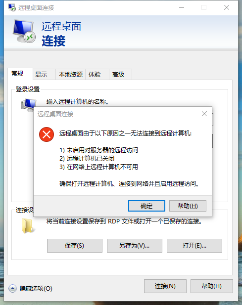
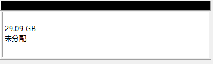
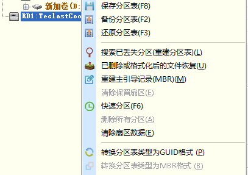
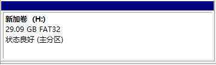
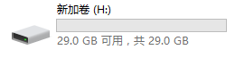

*2019-7-16*

---

**Typora 的 markdown 语法**

| 操作              | 语法                                                         | 效果                      |
| ----------------- | ------------------------------------------------------------ | ------------------------- |
| 标题              | `ctrl + 数字键`                                              |                           |
| 下划线            | `ctrl + u`                                                   | <u>测试Test</u>           |
| 删除线            | `alt + shift + 5`                                            | ~~测试Test~~              |
| 字体加粗          | `ctrl + b`                                                   | **测试Test**              |
| 字体倾斜          | `ctrl + i`                                                   | *测试Test*                |
| 无序列表          | `- + space + enter`                                          |                           |
| 有序列表          | `数字键 + space + enter`                                     |                           |
| 引用              | `> + space + enter` 或者 `ctrl + shift + q`                  |                           |
| 插入链接          | `ctrl + k`                                                   | [测试Test](www.baidu.com) |
| 插入图片          | `ctrl + shift + i`                                           |                           |
| 代码块            | `ctrl + shift + f`                                           | 需自行设置                |
| 文章跳转          | `ctrl + home` 跳转至文章开头，`ctrl + end` 跳转至文章末尾    |                           |
| 选中英文单词/中文 | `ctrl + d` 或者 `ctrl + shift + left/right` 左右进行文本选中 |                           |
| 按行选中          | `ctrl + l`                                                   |                           |
| 快速搜索          | `ctrl + f`                                                   |                           |
| 替换              | `ctrl + h`                                                   |                           |
| 快速生成表格      | `ctrl + t`                                                   |                           |
| 快速打开笔记      | `ctrl + p`                                                   |                           |
| toc 快速生成目录  | `[toc] + enter`                                              |                           |
| 着重关键字        | `ctrl + shift + 反引号键`（tab 键上面的那个键）              | `测试Test`                |
| 表情符号          | `英文状态下的引号，输入字母自动显示表情符号` 或者 `ctrl + shift + b` | 😂                         |
| 新建文件          | `ctrl + n`                                                   |                           |
| 显示和隐藏侧边栏  | `ctrl + shift + 1(数字1)`                                    |                           |
| 全屏切换          | `F11`                                                        |                           |
| 分割线            | `--- + enter`                                                |                           |
| 段落快捷键        | `ctrl + 0`                                                   |                           |
| 高亮              | `== + 文字 + ==`                                             | ==测试Test==              |

---

**远程连接 CentOS 系统**

直接利用 Windows 的远程桌面连接工具是这样的：

CentOS 的网络配置

CentOS 开启访问权限

---

**更改驱动器号和路径，系统找不到指定文件**

### 解决方法

1、打开“磁盘管理”，在U盘对应的磁盘空间上右击，选择“删除卷”，最终效果如下：

2、下载DiskGenius，在U盘上右击，选择“转换分区类型为GUID格式”

3、打开磁盘管理，在U盘对应的磁盘空间上右击，选择“新建简单卷”，直接下一步，最终效果如下：

4、完成。

---

